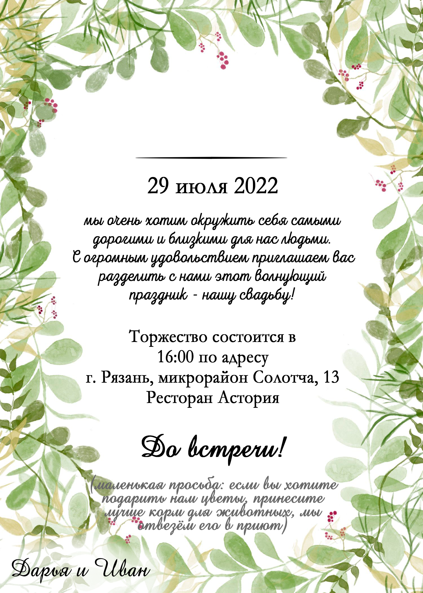

# wedding-naming-script
# Приложение для создания пригласительных на свадьбу
На самом деле не знаю для кого это сейчас пишу, ведь никто, кроме, возможно, Феди, это не прочитает. 
## Значит как система работает:
1. Есть шаблон пригласительного:

и на него всё будет рисоваться.
2. Записываем все данные в формате, как в example.csv. 
> m - значит male, f - female, p - pair (захватывает 2 человека), "-" - пропуск
3. В конфиге файла scpipt.py мы выставляем всё, что нам нужно:
'''
# Имя файла таблицы
csv_filename = './example.csv'
# Имя файла шаблона
template_filename = "./template.png"
# Имя папки сохранения (/ в конце нужен)
save_folder = "./example/"

# шрифт имени
font_name = {
    "family": './fonts/AmadeusAP.otf',
    "size": 120,
    "color": "#000000",
    "bold": False
}
# отступ сверху для имени (в доле от высоты изображения)
name_margin_factor = 0.233

# шрифт верхней надписи
font_upper = {
    "family": './fonts/AmadeusAP.otf',
    "size": 80,
    "color": "#000000",
    "bold": True
}
# отступ сверху для верхней надписи (в доле от высоты изображения)
upper_margin_factor = 0.18
'''
4. Запускаем программу. Если вы проигнорировали пункт 2 или опечатались, придётся самому определять тип человека (пары)
5. Результаты складываются в папочку, указанную в конфиге
6. Вы великолепны!
